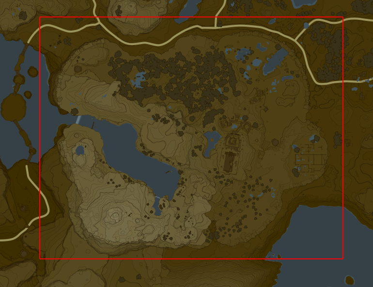

# The Great Plateau barrier

The thing to know about the Great Plateau kill fog and box is that they both disappear
after you get the paraglider. The corresponding flag is called `IsGet_PlayerStole2`.
(I have no idea why Nintendo gave it that name.)

As it turns out, that flag is only checked by 5 functions in the entire program.
One of them is the 'PlayerNormal' code which is responsible for handling Player (i.e. Link) events.

In that large AI function, the following piece of code can be seen:

```cpp
if ( !isDebug1 && !isDebug2 )
{
  if ( !hasParaglider(0) &&
       (x < -1600.0 || x > -350.0 || z < 1400.0 || z > 2400.0) )
  {
    ...
    // 奈落開始待ち = 'wait for abyss start' (= voidout)
    // 奈落 is also referred to as 'Hell' internally (there's a PlayerHell state).
    return changeState(v1, "奈落開始待ち", 0);
  }
}
```

What this piece of code does is force Link to void out if (a) debug flags aren't set,
(b) he doesn't have the paraglider, (c) Link's coordinates are not inside this rectangle:

.

It is a simple, hardcoded, coordinate-based check, and it is embedded in the Player actor code,
so glitching past it is impossible.
